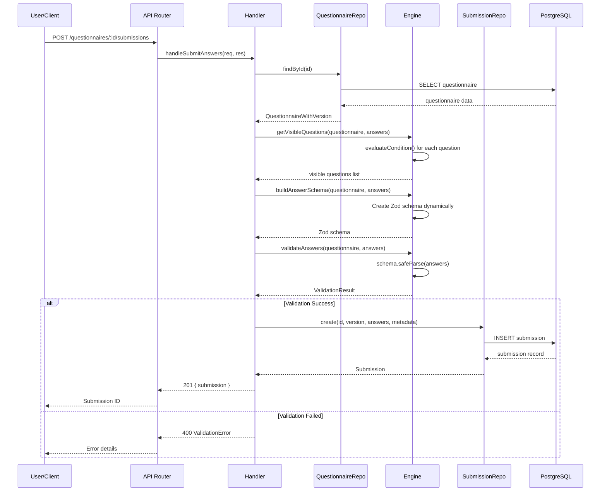
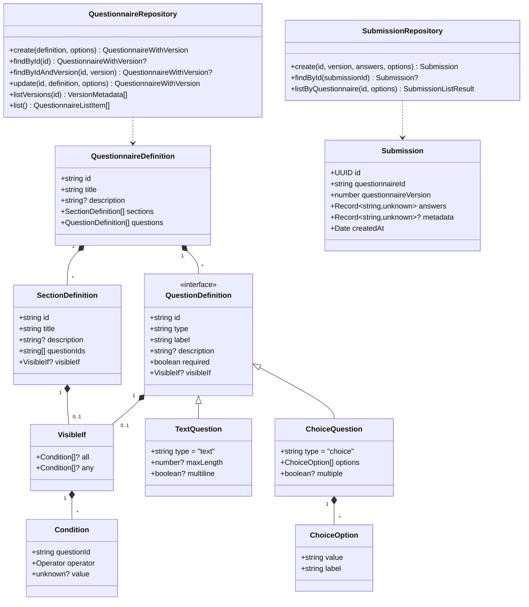
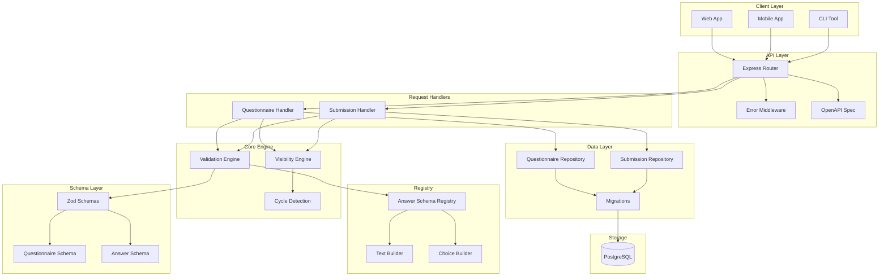
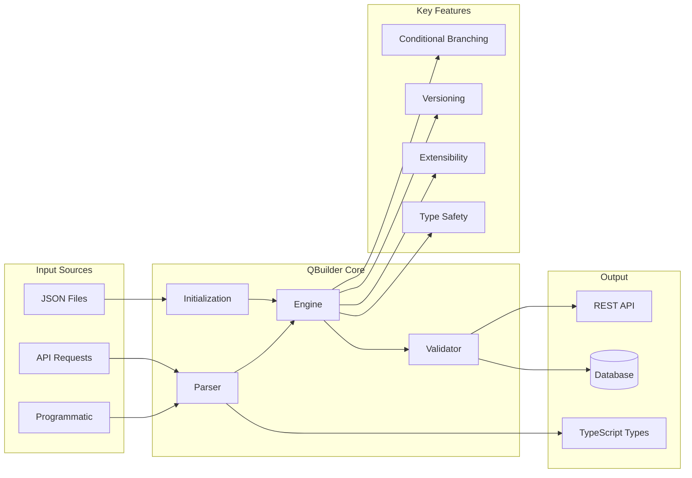
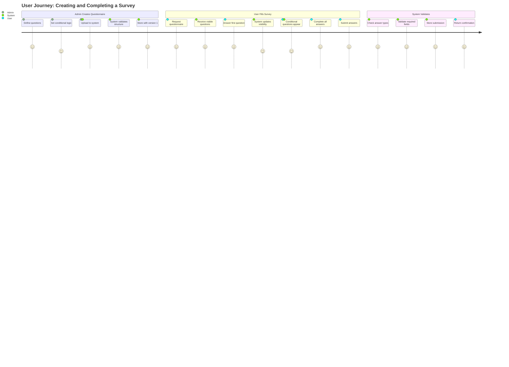
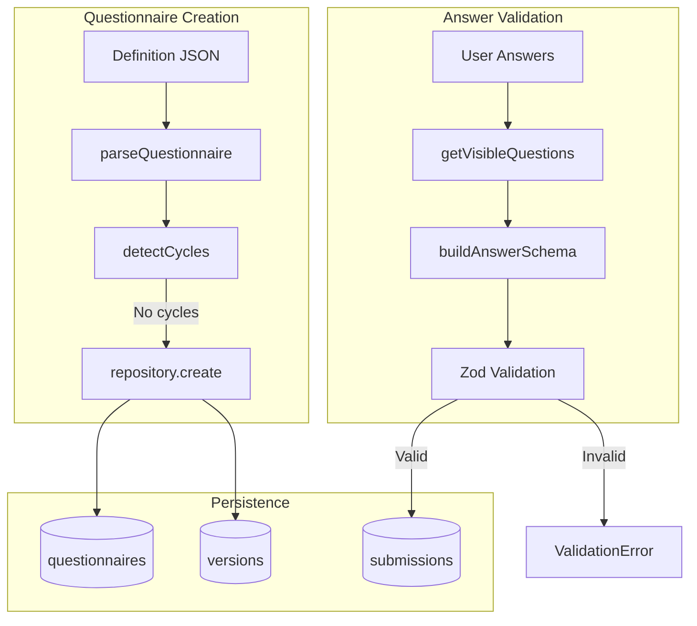
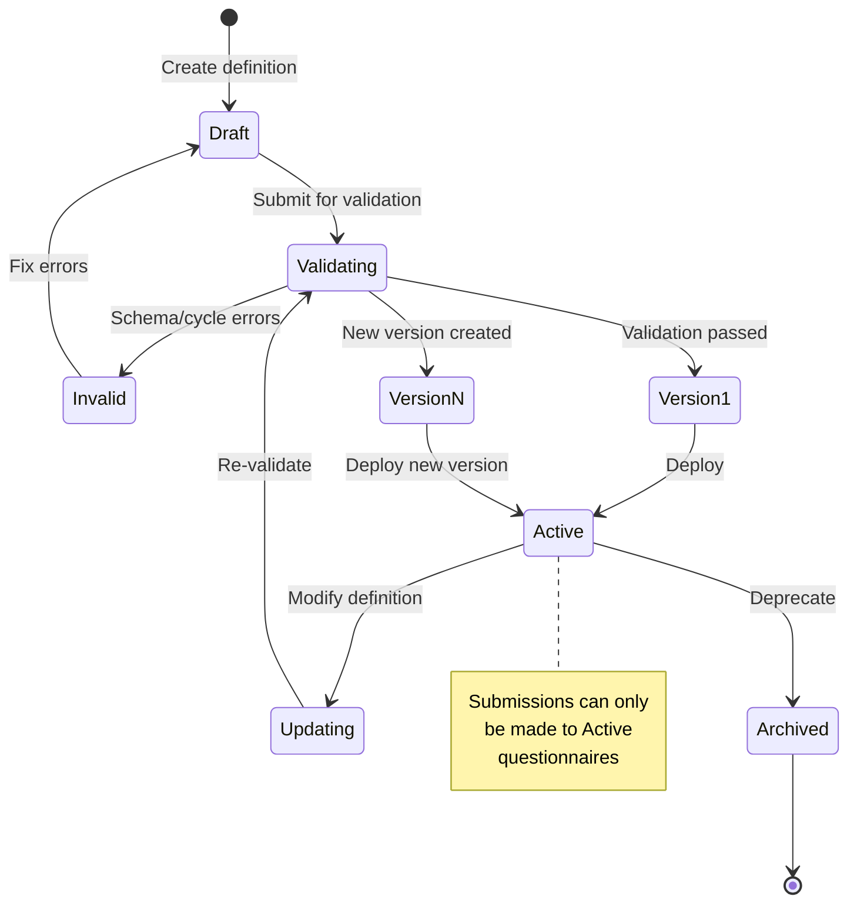

# QBuilder Architecture Diagrams

This document contains visual diagrams representing the QBuilder questionnaire engine architecture, data flow, and user interactions.

## Table of Contents

- [Sequence Diagram](#sequence-diagram---submit-answers-flow)
- [Class Diagram](#class-diagram)
- [Architecture Diagram](#architecture-diagram)
- [Overview Diagram](#overview-diagram)
- [User Journey](#user-journey-diagram)
- [Data Flow Diagram](#data-flow-diagram)
- [State Diagram](#state-diagram---questionnaire-lifecycle)

---

## Sequence Diagram - Submit Answers Flow

Shows the complete flow when a user submits answers to a questionnaire.

---

## Class Diagram

Shows the main data structures and their relationships.

---

## Architecture Diagram

Shows the layered architecture and component dependencies.

---

## Overview Diagram

High-level view of system components and features.

---

## User Journey Diagram

Shows how admins and users interact with the system.

---

## Data Flow Diagram

Shows how data moves through processing stages.

---

## State Diagram - Questionnaire Lifecycle

Shows the different states a questionnaire can be in.

